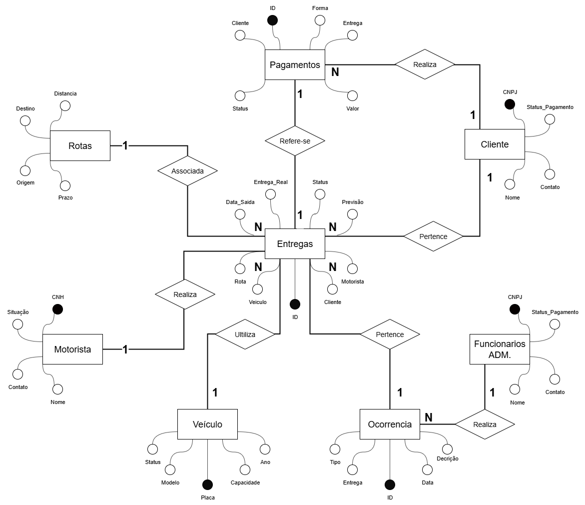

# 🚚 **Sistema de Logística Integrado** - README 🚛

Bem-vindo ao **Sistema de Logística Dinâmico**! Este banco de dados é o coração pulsante de uma operação logística moderna, projetado para gerenciar entregas eficientes, frotas ágeis e clientes satisfeitos. Imagine um hub central onde rotas se entrelaçam como estradas digitais, veículos zumbem como abelhas operárias e pagamentos fluem como rios de eficiência. Desenvolvido em SQL, este sistema é escalável, robusto e pronto para impulsionar sua logística para o próximo nível! 🌟

## 📋 **Visão Geral do Projeto**
- **Objetivo Principal**: Automatizar e otimizar processos logísticos, desde o cadastro de clientes até o rastreamento de entregas em tempo real.
- **Tecnologias Utilizadas**:
  - Banco de Dados: MySQL/PostgreSQL (compatível com SQL padrão).
  - Estrutura: Tabelas normalizadas com relacionamentos via chaves estrangeiras para integridade de dados.
  - Recursos Avançados: Procedimentos armazenados (stored procedures) para operações complexas e consultas otimizadas.
- **Por Que Criativo?** Pense nisso como um "GPS para Negócios": cada tabela é um nó em uma rede de rotas, guiando dados de forma inteligente e visualizando fluxos como um mapa interativo! 🗺️

## 🏗️ **Estrutura do Banco de Dados**
O sistema é dividido em módulos modulares, como peças de um quebra-cabeça logístico. Cada arquivo SQL representa um componente chave. Aqui vai um **mapa visual** das tabelas principais:

  
   

- **Tabelas Principais** (resumidas com emojis para visual flair):
  - **Clientes** 👥: Armazena dados de clientes, endereços e histórico de pedidos.
  - **Funcionários/Admin** 👔: Gerencia equipe administrativa e permissões de acesso.
  - **Entregas** 📦: Registra status de entregas, prazos e rastreamento.
  - **Veículos** 🚗: Detalhes de frota, manutenção e disponibilidade.
  - **Ocorrências** ⚠️: Log de incidentes, atrasos ou problemas na rota.
  - **Frotas** 🚌: Organização de grupos de veículos por região ou tipo.
  - **Motoristas** 🚙: Perfis de condutores, licenças e horários.
  - **Pagamentos** 💰: Controle de faturamento, recibos e integrações financeiras.
  - **Rotas** 🛣️: Planejamento de caminhos otimizados com distâncias e tempos estimados.

## 🔧 **Como Instalar e Usar**
Siga estes passos para "ligar o motor" do seu sistema logístico! ⛽

1. **Pré-requisitos**:
   - Instale um SGBD como MySQL (versão 8.0+) ou PostgreSQL.
   - Ferramentas: MySQL Workbench ou pgAdmin para visualização gráfica.

2. **Instalação**:
   - Clone ou baixe os arquivos SQL do repositório.
   - Execute os scripts na ordem recomendada:
     - **Primeiro**: `criacao-consultas.sql` – Cria tabelas base e consultas iniciais.
     - **Em Seguida**: Arquivos modulares (ex: `sistema_logistica_clientes.sql` para clientes).
     - **Por Último**: `Procedures.sql` – Adiciona procedimentos armazenados para automações.

3. **Testando o Sistema**:
   - Insira dados de amostra via INSERTs nos scripts.
   - Rode uma consulta exemplo: `SELECT * FROM entregas WHERE status = 'Em Rota';` para ver entregas ativas! 📊

